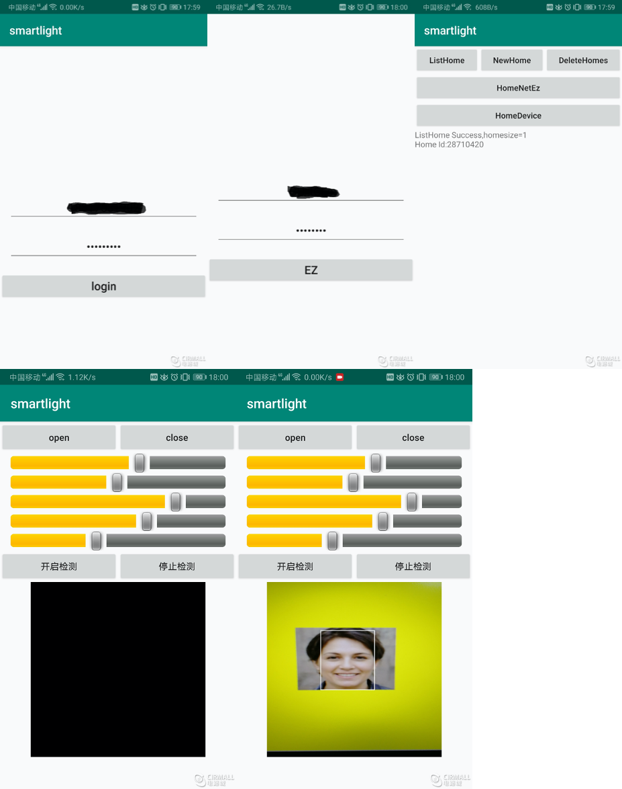

# Tuya Smart Light Demo App

This project wins the Tuya App SDK Camp Competition in Dec, 2020 by 徐阳. It's developed using [Tuya Android Home App SDK](https://github.com/tuya/tuya-home-android-sdk), which enables you to quickly develop branded apps connecting and controlling smart scenarios of many devices.

For more information, please check [Tuya Developer Website](https://developer.tuya.com/cn/).

### Tuya App SDK开发 + 随视频场景变化的智能灯

### 作品说明

作品分为两个部分:

1.利用涂鸦api实现基本功能，包括用户登录，创建家庭，设备配网，设备基本功能控制如亮度，冷暖，RGB控制。

2.在基本功能的基础上，通过摄像头，感知周围场景，调节灯的颜色
主要想做的是，在观看电影或者电视的时候，通过摄像头，检测视频中的场景，调节灯的颜色来提高观影氛围，如视频中蓝天场景时，将灯调整为蓝色，视频中有草地场景时，将灯调整为绿色，视频中为夜晚时，将灯调暗。还有人脸检测的功能，在检测到场景中有人时，将亮度调高。
本次实现的实现比较简单，只是检测图片的平均值来决定灯的颜色，后续可添加智能检测算法。

作品展示图片：

### 个人心得

1.涂鸦的api使用很简单，通过账户，家庭，房间对设备的管理定义也很合理，参考涂鸦的api doc就实现了控制设备基本的功能。这次的活动时间较短，其实还是需要开发者具有一定的android或者ios的开发技术。由于我自己并非android开发，只是以前简单的学习过一点点，而且平时时间也有限，所以这次做的ui和实现的功能也是比较简单，主要是以功能验证为主了。
2.在开发过程中获取家庭的详细信息 getHomeDetail 这个api开始没有调用，导致一直获得不到设备id，特此记录一下
3.灯的功能点文档介绍不清晰，
//设置 dpId 为 101 的布尔型功能点示例 作用:开关打开 dps = {"101": true};
参考demo的代码，开关的功能点为1。其他功能类似。
还有灯的模式和5路灯关系没有弄的很明白。
4. 希望涂鸦能以后可以开展一些设备端学习的活动。：）
